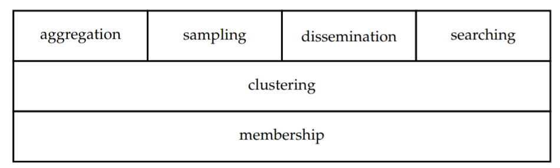

# py-unsserv
[](https://travis-ci.com/aratz-lasa/py-unsserv)
[](https://codecov.io/gh/aratz-lasa/py-unsserv)

[](https://www.python.org/downloads/release/python-370/)
[](https://www.python.org/dev/peps/pep-0008/)
[](https://github.com/psf/black)
[](http://mypy-lang.org/)

UnsServ implemented in Python.

## UnsServ
UnsServ is a modular unstructured peer-to-peer solution composed 
of independent services that aim to provide basicfunctionalities,
designed for using them as underlying technology.

## Paper
[Original UnsServ academic paper](https://aratz.lasa.eus/file/unsserv.pdf)

### What is unstructured peer-to-peer?
Peer-to-peer overlays canbe classified into two categories:
structured or unstructured. 
In structured overlay the network is shaped into a certain topology,
by constraining nodes to bond to neighbours that fulfill certain
criteria. Whereas, unstructured overlays do not establish a global 
structure and nodes maintain rather random connections. 

When developing decentralized networks, structured solutions are
the most popular ones because of the simple key-value storage 
model they offer through Distributed Hash Tables (DHTs). 
However, unstructured overlays, as the name states, they 
do not offer a clear structure. This, makes it hard to understand 
their  utility and to obtain a comprehensive global view.
Nevertheless, unstructured networks are able to give core 
functionalities that are hard to implement with DHTs, or even 
improve them through an hybrid solution.

### Services

These services can be seen as stacked modular technologies. 
The first layer is only composed of the membership service. 
This is the underlay that all the other services use. 
Next, clustering is placed on top of membership. It is 
necessary to denote that this is an optional layer, 
because biasing is not always needed. Finally, we position 
the remaining services on top of the first two layers: clustering,
sampling, dissemination and searching.

#### Membership
An underlying technology is needed for providing nodes
with random neighbours to exchange the information with.
This service, which is called membership, tries to fill 
the local view by producing uniformly random groups of neighbours.
It is also in charge of detecting and replacing neighbours churns.

#### Clustering
The clustering service, which aims to introduce bias in
unstructured networks. For example, you may want to better match
the physical topology, sorting or grouping peers by network distance.
For that, the clustering service adds some loose rules and
probabilistic techniques to the membership management.

#### Aggregation
Aggregation refers to compute a global information from distributed
numeric values in the network. This functionality is important for 
systems monitoring or tuning metrics that depend on overall network’s
quality. For example, it may be important to keep track of the
current network size *N*, the congestion in the overlay, or even
the average latency in node connections.

#### Sampling
Randomness is a key characteristic in statistics. That is why 
it is a highly valued quality for many applications.
Furthermore, random sampling may also be needed for producing 
peer-to-peer systems. Hence, sampling has been selected as
one of the main services. However, at first it may look unnecessary.
One could argue that the membership service already features it. 
But this is only true when the local view is cyclically updated, 
and even so, membership is not able to give explicit control over
the random sampling. So, it is a better approach to decouple these 
two services.

#### Dissemination
There are a lot of applications which need to broadcast data as 
efficient and as fast as possible. For example, streaming media 
services, news feed or even multiplayer video games.
Unstructured peer-to-peer may contribute greatly to this area 
by implementing a dissemination service. 
For it, it just needs to create a proper mechanism on top of the 
overlay that tries to minimize message redundancy and peers inactivity.
If the system is able to maximize peers contribution and coordinate 
them to forward data efficiently, it will offer a superior solution 
than a client-server model.

#### Searching
There a lot of cases where we want to find a certain file or 
multiple files under a common topic. However, in distributed 
systems this is a hard task because the files are dispersed among 
participants. Commonly, searching is implemented by means of 
structured DHTs, which are able to find specific files 
deterministically. But in some cases there is no need for such strong 
guarantees, and unstructured solutions may be preferred as a 
caching-like service. That is to say, fast-response queries are 
performed through the unstructured search, and only if they fail, 
structured deterministic queries are carried out.

## Usage
```python
```