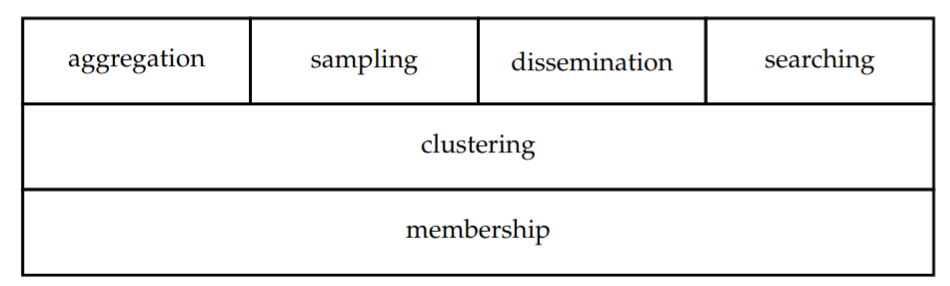

Concepts
=========

UnsServ
--------
UnsServ stands for unstructured peer-to-peer services. It is a programming library
intended for providing P2P network maintenace and functionalities (also called services)
out-of-the-box. This library is for using it as the underlying techonology for
software projects.

Extreme vs Stable
------------------
**py-unsserv** presents two versions or editions of the same functionalities.
Each of these versions implement different protocols for each of the services.

On the one hand, there is **Extreme** that is designed for very volatile environments,
where nodes or devices stay connected for a very short time. A representative
scenario would be a Smart City, where IoT mobile devices (such as electric bikes and
public buses) can only peer with each other for a few seconds, before before leaving
the range of the other.

On the other hand, there is **Stable** that is intended for networks where devices
stay connected for longer period of times (a minimum of a few minutes). A file-sharing
application would be a representative scenario where this version could be used.

Services
---------
UnsServ presents its functionalities by means of six services. These services can be seen as
stacked modular technologies. The first layer is only composed of the Membership service.
This is the underlay that all the other services use. Next, Clustering is placed on top of Membership.
It is necessary to denote that this is an optional layer, because biasing is not always needed.
Finally, we position the remaining services on top of the first two layers: clustering, sampling,
dissemination and searching.

Membership
+++++++++++
An underlying technology is needed for providing nodes with random neighbours to
exchange the information with. This service, which is called **Membership**, tries to
fill the local view by producing uniformly random groups of neighbours. It is also in
charge of detecting and replacing neighbours churns.

Clustering
+++++++++++
The **Clustering** service, which aims to introduce bias in unstructured networks.
For example, you may want to better match the physical topology, sorting or grouping
peers by network distance. For that, the clustering service adds some loose rules and
probabilistic techniques to the membership management.

Aggregation
++++++++++++
**Aggregation** refers to compute a global information from distributed numeric values in the network.
This functionality is important for systems monitoring or tuning metrics that depend on overall
network’s quality. For example, it may be important to keep track of the current network size N,
the congestion in the overlay, or even the average latency in node connections.

Sampling
+++++++++
Randomness is a key characteristic in statistics, because selecting representative samples of peer
properties on the network, is a highly valued ability for many applications. Furthermore, random
sampling may also be needed for producing peer-to-peer systems. Hence, **Sampling** has been
selected as one of the main services. However, at first it may look unnecessary. One could argue
that the Membership service already features it. But this is only true when the local view is
cyclically updated, and even so, Membership is not able to give explicit control over the
random sampling. So, it is a better approach to decouple these two services.

Dissemination
++++++++++++++
There are a lot of applications which need to broadcast data as efficient and as fast as possible.
For example, streaming media services, news feed or even multiplayer video games. Unstructured
peer-to-peer may contribute greatly to this area by implementing a **Dissemination** service.
For it, it just needs to create a proper mechanism on top of the overlay that tries to minimize
message redundancy and peers inactivity. If the system is able to maximize peers contribution and
coordinate them to forward data efficiently, it will offer a superior solution than a client-server model.

Searching
++++++++++
There a lot of cases where we want to find a certain file or multiple files under a common topic.
However, in distributed systems this is a hard task because the files are dispersed among participants.
Commonly, **Searching** is implemented by means of structured DHTs, which are able to find specific files
deterministically. But in some cases there is no need for such strong guarantees, and unstructured
solutions may be preferred as a caching-like service. That is to say, fast-response queries are performed
through the unstructured search, and only if they fail, structured deterministic queries are carried out.